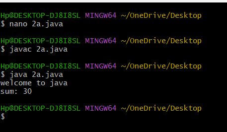
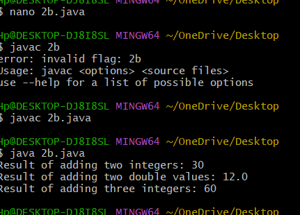
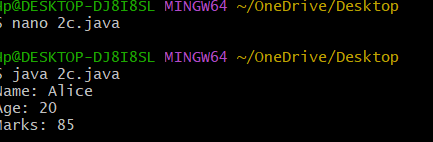

# EXPERIMENT2
##TASK 2:2A)implement of class mechanism in java
```
class myclass {
    void displaymessage() {
        System.out.println("welcome to java");
    }
    int add (int a, int b) {
        return a+b;
    }
    public static void main(String[] args) {
        myclass obj = new myclass();
        obj.displaymessage();
        int result = obj.add(10, 20);
        System.out.println("sum: " + result);
    }
}

```
#output



##2b)write a java program implement method of overloading
```
class OverloadExample {
    int add(int a, int b) {
        return (a + b);
    }

    double add(double a, double b) {
        return a + b;
    }

    int add(int a, int b, int c) {
        return a + b + c;
    }

    public static void main(String[] args) {
        OverloadExample obj = new OverloadExample();
        int sum1 = obj.add(10, 20);
        double sum2 = obj.add(5.5, 6.5);
        int sum3 = obj.add(10, 20, 30);
        System.out.println("Result of adding two integers: " + sum1);
        System.out.println("Result of adding two double values: " + sum2);
        System.out.println("Result of adding three integers: " + sum3);
    }
}

```
#output


##2c)implement of java program
```
class Student {
String name;
int age;
int marks;
Student (String n, int a, int m) {
name = n;
age = a;
marks = m;
}
void display ( ) {
System.out.println ("Name: " + name);
System.out.println ("Age: " + age);
System.out.println ("Marks: " + marks);
}
public static void main(String[] args) {
Student S1 = new Student ("Alice", 20, 85);
S1.display ( );
}
}

```
#output



